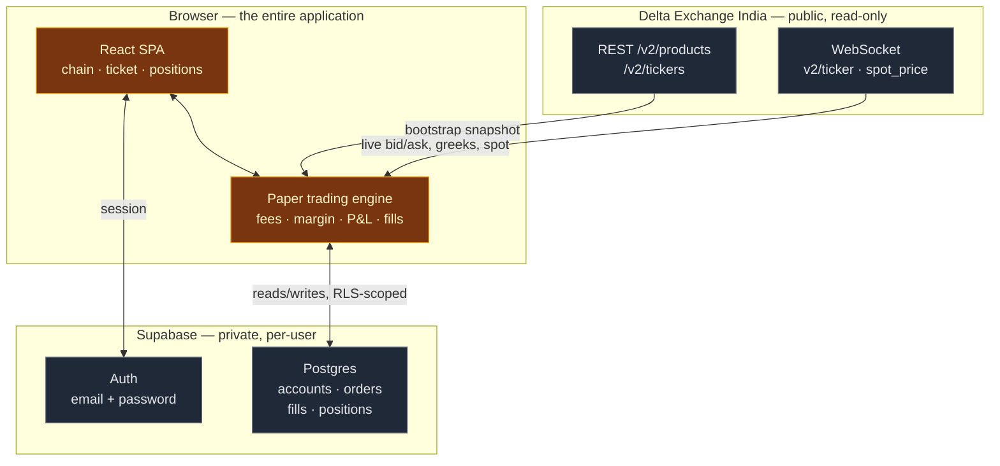
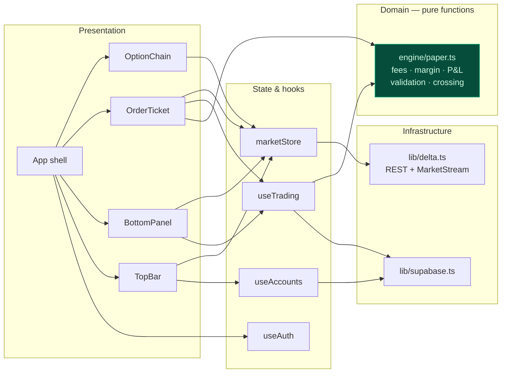
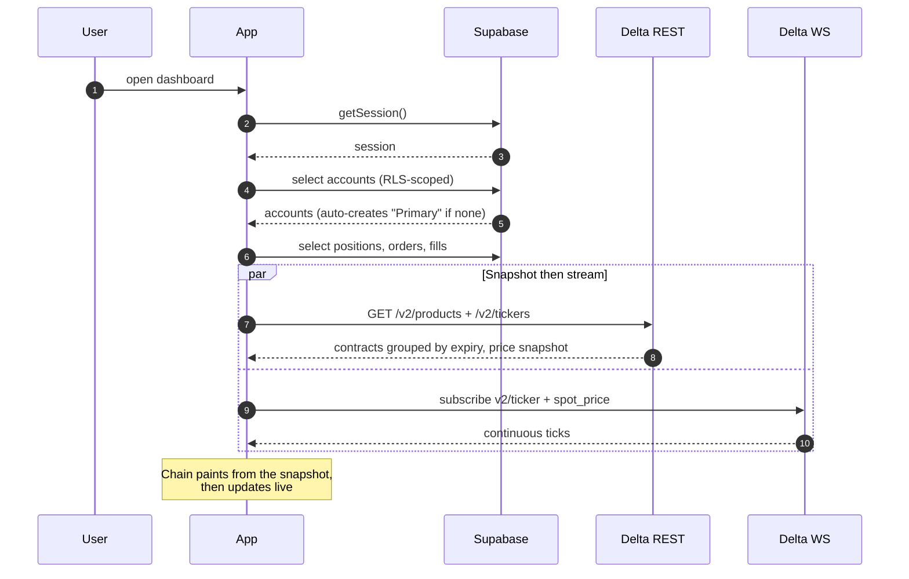
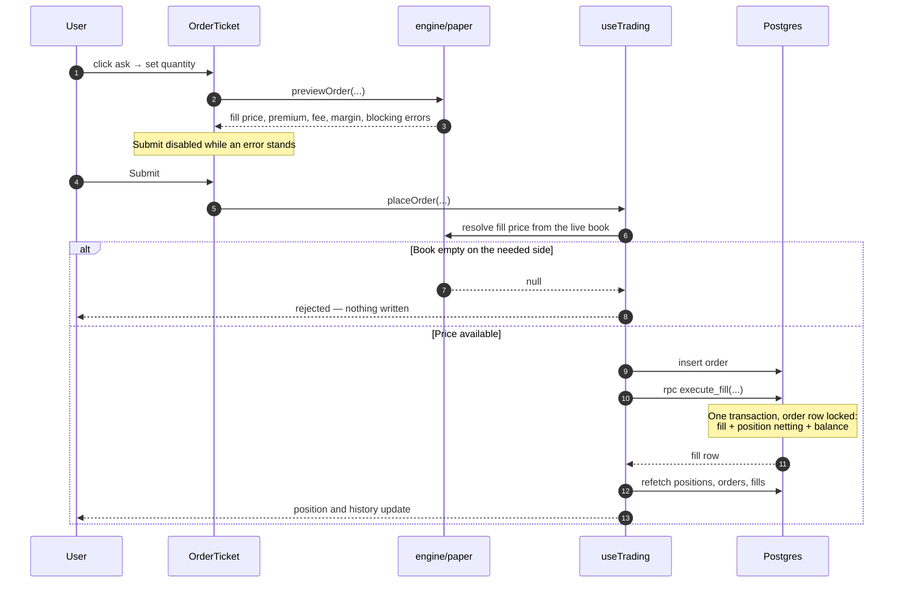
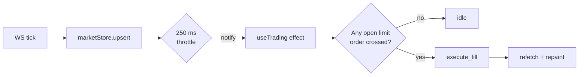
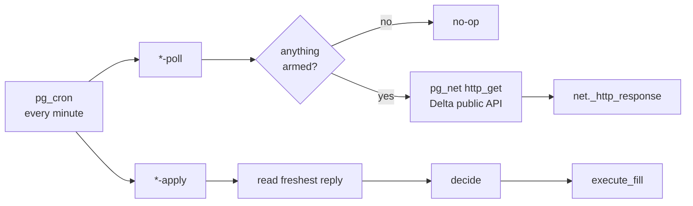
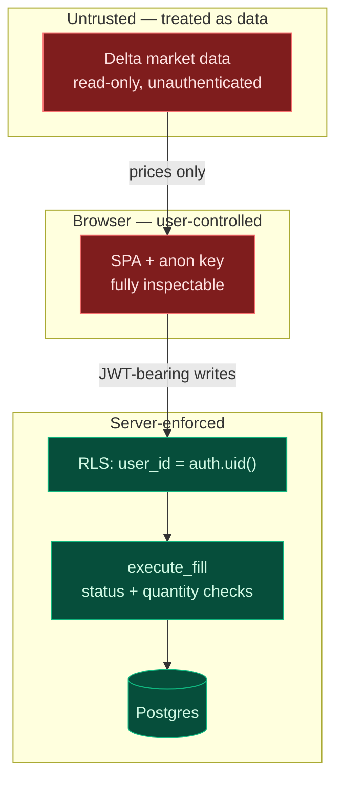

# High-Level Design

**XAUT Options — Paper Trading Terminal**

| | |
| --- | --- |
| Purpose | Simulate options trading on XAUT against live Delta Exchange prices |
| Users | Internal — traders and analysts practising or evaluating strategies |
| Scope | Option chain, order entry, position and P&L tracking, trade history |
| Explicitly out of scope | Real order placement, custody, settlement, advice |
| Status | Functional; expiry settlement and server-side fills deferred |

---

## 1. Problem and goals

Evaluating an options strategy on XAUT requires live prices, but rehearsing it on
the real venue requires real capital. This system provides the former without the
latter: a terminal that looks and behaves like Delta Exchange's own, priced off
the same book, where every order is simulated.

| Goal | Why | How it is met |
| --- | --- | --- |
| Realistic prices | A simulator priced off stale or synthetic data teaches the wrong lessons | Live WebSocket feed from Delta's public API |
| Honest P&L | Marking at mid flatters every position by half the spread | Positions marked at the price you would actually exit at |
| Cannot trade for real | The blast radius of a bug must be zero | No API key, no signed endpoint — structurally incapable |
| Familiar interface | Muscle memory should transfer to the real terminal | Delta's chain layout and click-to-trade semantics |
| Parallel strategies | Comparing approaches needs isolated books | Multiple independent paper accounts |

### Non-goals

Real trading, custody of funds, market making, backtesting over history, and any
form of financial advice. This is a rehearsal environment.

---

## 2. System context

**The critical asymmetry:** the Delta connection is *read-only and unauthenticated*.
No credential exists that could place a real order. Writes go only to our own
Postgres.

### External dependencies

| Dependency | Used for | Auth | Failure impact |
| --- | --- | --- | --- |
| `api.india.delta.exchange` REST | Contract list, opening price snapshot | None | App cannot start — shows retry |
| `socket.india.delta.exchange` WS | Live quotes, greeks, spot | None | Prices freeze; status turns red; auto-reconnects |
| Supabase Auth | Sign-in, session | — | Cannot sign in |
| Supabase Postgres | All persistence | Anon key + RLS | Cannot trade; chain still renders |

> XAUT options are listed **only on the India host**. The global
> `api.delta.exchange` carries BTC and ETH options exclusively — a fact confirmed
> by inspection during design, and the reason the host is not configurable.

---

## 3. Architecture

There is no application server. The browser is the compute tier; Supabase is the
data tier; Delta is a read-only feed.

### Layer responsibilities

| Layer | Holds | Must not |
| --- | --- | --- |
| Presentation | Rendering, local form state | Contain money maths or call Supabase directly |
| State & hooks | Server data, subscriptions, orchestration | Contain pricing rules |
| Domain (`engine/paper.ts`) | Every money rule, as pure functions | Import React, Supabase, or perform I/O |
| Infrastructure | Network transports | Interpret business meaning |

The domain layer being pure and I/O-free is deliberate: it is the part where a
mistake costs the most, and purity is what makes it directly testable. It is
covered by 30 assertions run against a real ticker payload.

---

## 4. Data flow

### Startup

The REST snapshot exists so the chain is populated immediately rather than filling
in strike by strike as ticks arrive.

### Placing an order

Resolving the price *before* writing anything is what prevents a stranded order
row when the book is empty.

### Resting limit orders

**This engine runs in the browser.** Resting orders fill only while a dashboard tab
is open — the single most important operational caveat for *manual* trading,
accepted deliberately to avoid standing server infrastructure.

### Strategy engines

Both automated strategies run **server-side on `pg_cron`**, so they trade with no
tab open. Neither uses the browser fill engine; both write through the same
`execute_fill` a manual order does.

The poll and the apply are separate jobs because `pg_net` is **asynchronous**:
the request is only sent after its transaction commits, and the reply lands in
`net._http_response` some time later. `apply` therefore reads whatever reply is
freshest rather than the one its own poll fired — matching them by shape, within
a freshness window.

| | Auto strategy | Delta strategy |
| --- | --- | --- |
| Migration | [`0008`](../supabase/migrations/0008_strategy_engine.sql), fixed by [`0011`](../supabase/migrations/0011_strategy_expiry_fix.sql) | [`0012`](../supabase/migrations/0012_delta_strategy_engine.sql), latterly [`0044`](../supabase/migrations/0044_futures_delta_hedge.sql) |
| Cadence | Top of the hour only — 1h bars close there | Every minute, spaced by `cycle_seconds` |
| Feed | Candles + full option chain (~964 KB) | XAUT tickers only (~143 KB), options **and** the perpetual in one request |
| Needs | Last closed candle, strike ladder | Per-strike `greeks.delta`, both sides of the touch, plus `gamma` on the options book (the band is derived from it) and the perpetual's touch on the futures one |
| State | `strategy_settings.last_acted`, one action per bar | `delta_strategy_settings` — roll budget, touched strikes, session day |
| Books | One (`auto`) | Two: `delta` corrects Δp with options, `futures` with the XAUT perpetual. One engine, one settings table; the mode is read off the account's kind |

Two consequences worth stating plainly:

- **Failures are silent by construction.** Both return a bare action count, which
  `pg_cron` records as success either way. `0008` shipped reading a
  `settlement_time` field the tickers endpoint has never returned, so it placed
  nothing at all until `0011` — with no error anywhere. Every early return now
  emits `raise log`; the Postgres logs are the only place a skipped cycle is
  visible.
- **The delta strategy's rules exist twice.** `lib/deltaStrategy.ts` computes the
  readout in the browser; `0012` does the trading in PL/pgSQL. Only the
  TypeScript copy is under test, and nothing enforces that they agree.

---

## 5. Key design decisions

| # | Decision | Alternatives considered | Rationale |
| --- | --- | --- | --- |
| 1 | No application server | Node/Express + REST API | Nothing needs to run server-side except transactional writes, and Postgres functions cover those. Removes a deployment target and an auth hop. |
| 2 | Mark P&L at bid/ask, not mid | Mid, or mark price | Mid understates cost by half the spread on every position. Marking at the exit price makes the spread visible the moment you cross it. |
| 3 | Fill logic inside a Postgres function | Sequential client writes | A fill spans four tables. Client-side, a refresh mid-sequence leaves a fill with no position. One transaction with the order row locked makes that impossible. |
| 4 | Browser-side limit fill engine | Edge Function on cron | The browser already holds the live feed; the server would need its own. Cost: tab must stay open. Revisitable without schema change. |
| 5 | Per-expiry WS subscription | Subscribe to all strikes | One expiry is ~40 symbols instead of ~150. Held and resting symbols are pinned in so P&L and fills keep working elsewhere. |
| 6 | Throttle repaints to 4/sec | Render every tick | Ticks arrive far faster than perception. Writes land synchronously in a Map; only notification is throttled, so no data is dropped. |
| 7 | Balance excludes open positions | Debit premium on entry | `balance = start + realized − fees`, `equity = balance + unrealized`. Matches how Delta presents it and keeps realized and unrealized separable. |
| 8 | Fee rates read from the product | Hardcode 0.01% / 3.5% | The venue owns those numbers; reading them means the app tracks changes for free. |
| 9 | Strategy engines in PL/pgSQL on `pg_cron` | Edge Function; external worker | No new deployment target, and `pg_net` + `pg_cron` were already in use for settlement and TP/SL. Cost: HTTP orchestration inside Postgres is awkward — async replies matched by sniffing JSON shape, inside a freshness race, with no logging unless asked for. |
| 10 | One account `kind` per page | Separate tables per strategy | Orders, fills and positions are already scoped to an account, so a `kind` column partitions the three books with no schema duplication and no change to `execute_fill`. |
| 11 | Delta strategy acts once per cycle | Walk the whole ITM queue in one pass | Δp is re-read from fresh marks before each step, so a correction can never be sized against a book it has already changed. Slower to converge; cannot compound its own error. |
| 12 | Chain snapshot in an unlogged table | Temp table per cycle | A `language sql` body is validated at **creation**, so helpers cannot be compiled against a temp table that only exists at run time. It also avoids PL/pgSQL caching a plan for a relation dropped and recreated every minute. |

---

## 6. Security and trust boundaries

| Control | Enforced where | Guarantees |
| --- | --- | --- |
| Row Level Security | Postgres, all four tables | A user reads and writes only rows where `user_id = auth.uid()` |
| `WITH CHECK` on insert | Postgres | A row cannot be attributed to another user |
| Order lock in `execute_fill` | Postgres, `SELECT … FOR UPDATE` | Two tabs cannot fill one order twice |
| Status guard | `execute_fill` | Only an `open` order can fill |
| Public-endpoint-only design | Absence of credentials | No real order is possible |

### What the client is *not* trusted for

Client-side validation in `previewOrder` — margin sufficiency, tick alignment,
whole-lot quantities — is **UX, not security**. A user editing their own paper
balance harms only their own simulation, so this is accepted rather than
mitigated. The controls that do matter are the ones above, all server-side.

Verified during implementation: an anonymous insert is rejected with
`42501 violates row-level security policy`.

### Secrets

| Value | Location | Exposure |
| --- | --- | --- |
| Supabase anon key | `.env.local`, inlined at build | Public by design; RLS is the control |
| Supabase service key | Not used anywhere | — |
| Delta API key | Does not exist | — |
| User password | Supabase Auth only | Never touches app code |

---

## 7. Technology choices

| Concern | Choice | Why this one |
| --- | --- | --- |
| UI | React 19 + TypeScript | Types matter where money maths does |
| Build | Vite 7 | Fast HMR; static output deploys anywhere |
| Styling | Tailwind 4 | Dense terminal layouts without a parallel CSS vocabulary |
| Theme | Delta's own design tokens | Read off their running application; see *Visual fidelity* below |
| Typeface | Aileron via `@fontsource/aileron` | The typeface Delta uses; CC0, self-hosted |
| High-frequency state | `useSyncExternalStore` | Throttled external store; avoids context re-rendering the whole tree per tick |
| Backend | Supabase | Postgres, auth and RLS without operating a server |
| Transactions | PL/pgSQL function | Multi-table atomicity the client cannot provide |

Deliberately absent: no state-management library (one store and hooks suffice), no
component library (the layout is too specific), no data-fetching library
(refetch-after-mutation is adequate at this scale).

### Visual fidelity

The palette is not an approximation of Delta's look — it is their token set, read
directly from their running application and transcribed into
[`src/index.css`](../src/index.css) under their own token names, so the mapping
stays auditable.

| Delta token | Value | Used for |
| --- | --- | --- |
| `main-bg-surface` | `#18191e` | Page background |
| `main-bg-sub-surface` | `#111114` | Recessed areas, in-the-money rows |
| `main-bg-primary` | `#22242c` | Header, panels, modals |
| `main-bg-secondary` / `tertiary` | `#2d303a` / `#353845` | Controls, hover, borders |
| `main-text-primary` → `quaternary` | `#e1e1e2` → `#44464a` | Four-step text hierarchy |
| `positive-text` / `positive-bg` | `#33b991` / `#00a876` | Bids, longs, gains, buy actions |
| `negative-text` / `negative-bg` | `#ff5c5c` / `#eb5454` | Asks, shorts, losses, sell actions |
| `brand-india-bg-primary` | `#fe6c02` | Primary buttons |
| `brand-india-text-primary` | `#fe8935` | ATM row rule, active expiry pill, countdown |
| `misc-chart-bg-brand-india` | `#2f231b` | Muted brand backgrounds |

XAUT options are an India-only listing, so the accent is Delta **India's** orange.
The global site's brown `accent-brown` and yellow `warning` are the wrong brand
and are not used for accents here.

The typeface is **Aileron**, which is what Delta serves. It is public domain
(CC0 1.0) and bundled via Fontsource rather than hotlinked from their asset
server. Aileron derives from Helvetica, so its digits are uniform width — measured
identically at 23.19px across `0`–`9` — which is why Delta can leave
`font-variant-numeric: normal` and still get non-jittering price columns. The
`.num` helper sets `tabular-nums` anyway, as a no-op that only matters if the
webfont fails to load.

Verified by enumerating every colour the running app renders: all opaque values
resolve to a token in the table above, with no strays.

### Chain layout

Measured against their rendered chain rather than inferred:

| Property | Delta | Ours |
| --- | --- | --- |
| Columns per side | 18 | same |
| Column widths | 80px, 83 (OI, Volume), 91 (6H OI Chg.), 85 (24hr Chg.) | same |
| Bid / Mark / Ask cell | price above, IV beneath | same |
| Price format | `$128.10` | same |
| Price / IV size | 12px / 10px | same |
| IV colour | `#8e9298` | same |
| Row height | 43px | same |
| Strike gutter | 102px, centred, `#e1e1e2` | same |
| ATM marker | `#fe8935` rule above and below the row | same |
| In-the-money tint | **none** | none |
| Strike highlight | **none** | none |

The last two are worth stating explicitly: all 970 cells on their rendered chain
have transparent backgrounds. An earlier version of this app tinted in-the-money
rows and highlighted the ATM strike — both were inventions and have been removed.

#### Column order

Delta's two sides are **not** a clean mirror, so both orders are written out
literally in `OptionChain.tsx` rather than derived:

| Side | Order, left to right |
| --- | --- |
| Calls | Low · High · Open · Last · 24hr Chg. · Theta · Vega · Gamma · POS · 6H OI Chg. · Volume · Delta · Bid Qty · Bid · Mark · Ask · Ask Qty · OI |
| | **Strike** |
| Puts | OI · Bid Qty · Bid · Mark · Ask · Ask Qty · Delta · Volume · 6H OI Chg. · POS · Gamma · Vega · Theta · 24hr Chg. · Last · Open · High · Low |

Two asymmetries fall out of that. `OI` sits against the strike on both sides, and
the quote block reads Bid Qty → Bid → Mark → Ask → Ask Qty left-to-right on both
sides. Only the outer block — Delta, Volume, OI change, POS, greeks, OHLC — is
actually mirrored. A naive `reverse()` produces the wrong layout.

Column sources: OI, 6H OI change and Volume are USD figures (`oi_value_usd`,
`oi_change_usd_6h`, `turnover_usd`); Bid/Ask Qty and POS are expressed in the
underlying (contracts × `contract_value`); 24hr Chg. uses `ltp_change_24h`.

At 37 columns the chain is ~3,030px wide and scrolls horizontally, opening
centred on the strike gutter.

One intentional departure: a small brand-orange dot beside a strike where a
position is held. Delta surfaces that only in its positions table, but it is
worth having on the chain you are clicking through.

---

## 8. Quality attributes

| Attribute | Target | Approach | Status |
| --- | --- | --- | --- |
| Correctness of money maths | Exact | Pure domain layer, 30 assertions on real data | Verified |
| Price latency | Sub-second | WebSocket, 250 ms repaint throttle | Verified live |
| Transactional integrity | No torn fills | Single Postgres function, row lock | Function deploys and runs; write path pending first trade |
| Isolation between users | Total | RLS on every table | Verified — anon writes rejected |
| Reconnect resilience | Automatic | Exponential backoff to 15 s, 45 s heartbeat watchdog | Implemented |
| Graceful degradation | No silent wrong numbers | Absent quotes render `—`, never `0` | Implemented |

### Failure modes

| Failure | Behaviour | Rationale |
| --- | --- | --- |
| WS drops | Status → red, backoff reconnect, last prices held | Stale-but-labelled beats blank |
| One side of book empty | Market order blocked; P&L shows `—` | Never invent a price |
| Postgres unreachable | Order rejected with the error | Chain stays usable |
| Market order fill fails after insert | Order cancelled with a reason | A market order must never rest |
| Illiquid strike, absurd quote | Marked honestly at that quote | Real consequence of bid/ask marking |

---

## 9. Known limitations

| Limitation | Impact | Path forward |
| --- | --- | --- |
| Short-option margin approximated as `10% × spot + premium` | Margin differs from the venue's risk model | Delta does not expose the model publicly; long options are exact |
| No expiry settlement | Expired positions linger; must be closed manually | Read settlement price after expiry, realize intrinsic value |
| Limit fills need an open tab | Resting orders miss overnight moves | Edge Function on `pg_cron` |
| Fills ignore quoted size | Oversized orders fill at the touch | Walk the book against `bid_size`/`ask_size` |
| Taker fee assumed for maker fills | None today — both rates are 0.01% for XAUT | Branch on resting vs crossing |
| Refetch after mutation, no realtime | Second tab is briefly stale | Supabase Realtime on the four tables |
| Auto strategy acts only at the top of the hour | Five chances an hour, each losable to a flat bar or an unquoted strike; the bar is then consumed until the next hour | Retry within the hour rather than burning the bar on a skip |
| Strategy fills model no fee | An automated book overstates P&L by roughly the commission | Pass the computed fee to `execute_fill` as the ticket does |
| Delta rules implemented twice | The readout and the engine can disagree, and only the TypeScript copy is tested | One implementation — move the engine to a worker that imports `lib/deltaStrategy.ts` |
| `cycle_seconds` floors at the cron minute | A correction is sized against a snapshot up to a minute old | Sub-minute scheduling, or a worker holding the feed |

---

## 10. Related documents

| Document | Contents |
| --- | --- |
| [LLD.md](LLD.md) | Schema ERD, sequence diagrams, order state machine, netting algorithm, module contracts, formulas |
| [SETUP.md](SETUP.md) | Provisioning, environment, scripts, troubleshooting |
| [../README.md](../README.md) | Overview and feature summary |
