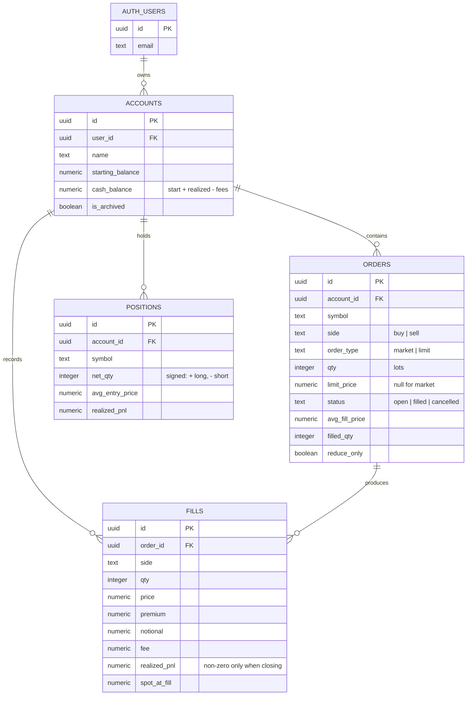
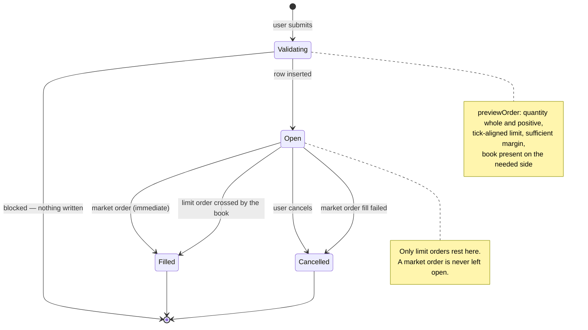
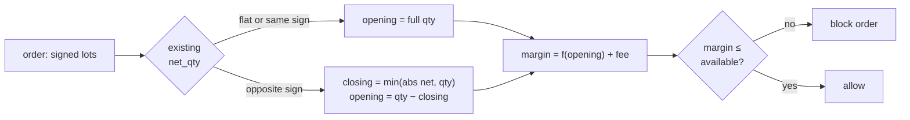
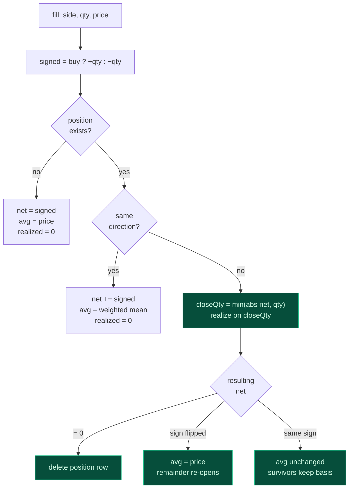
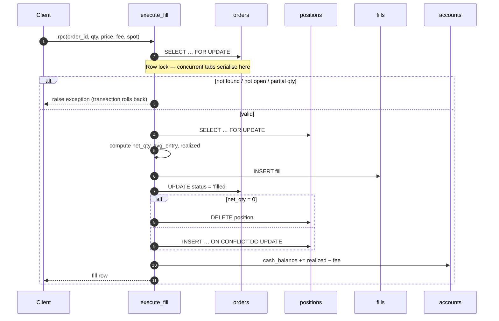
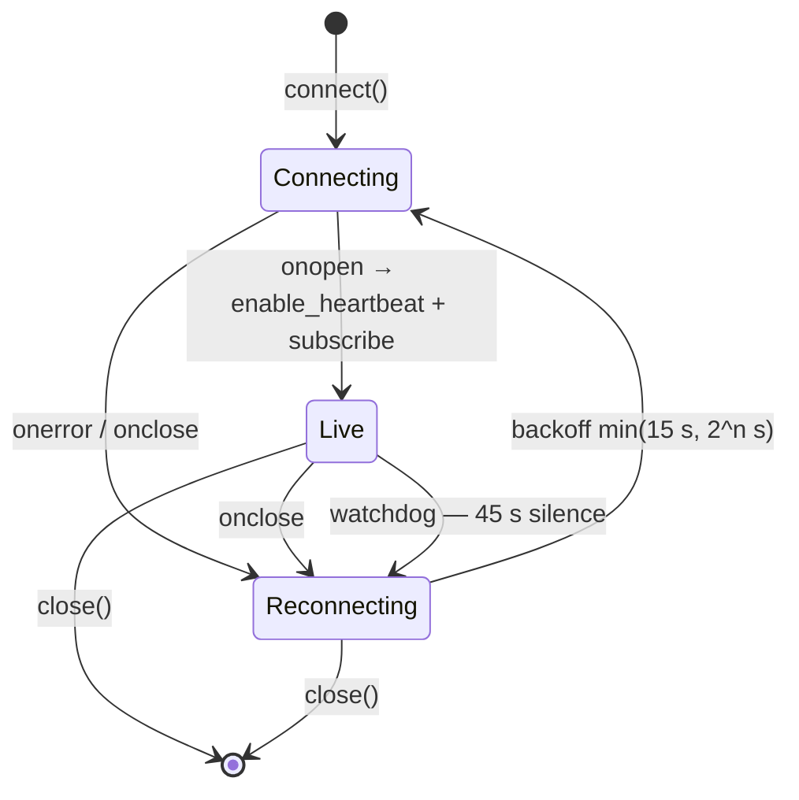

# Low-Level Design

**XAUT Options — Paper Trading Terminal**

Implementation-level reference: schema, algorithms, module contracts and formulas.
For rationale and system context see [HLD.md](HLD.md).

---

## 1. Contract mechanics

Everything downstream depends on getting these units right.

| Quantity | Formula | Example (4040 call @ 24.90, spot 4038.77) |
| --- | --- | --- |
| Contract value | Product field | `0.001` XAUT per lot |
| Premium (USD) | `price × contract_value × lots` | `24.90 × 0.001 × 1000 = $24.90` |
| Notional (USD) | `spot × contract_value × lots` | `4038.77 × 0.001 × 1000 = $4,038.77` |
| Quote unit | USD per XAUT | `24.90` |
| Tick size | Product field | `0.01` |

One lot is worth about 2.5 cents of premium and carries $4 of underlying
exposure. This is genuinely how Delta sizes XAUT options — it is why quoted book
sizes run to five figures, and why the UI shows four decimal places on premium
and fee columns.

### Symbol grammar

```
C-XAUT-4040-300726
│ │    │    └── expiry, ddmmyy (30 Jul 2026, settles 16:00 UTC)
│ │    └─────── strike price
│ └──────────── underlying
└────────────── C = call, P = put
```

`parseSymbol` returns `null` on anything that does not match, and callers treat
`null` as "not our instrument" rather than throwing.

---

## 2. Data model



### Invariants

| # | Invariant | Enforced by |
| --- | --- | --- |
| 1 | One netted position per `(account_id, symbol)` | `unique (account_id, symbol)` |
| 2 | A `positions` row always means live exposure | Row deleted when `net_qty` reaches 0 |
| 3 | A limit order has a price; a market order does not | `orders_limit_price_required` check |
| 4 | `qty > 0` on orders and fills | Column checks |
| 5 | `fills` are immutable | Never updated or deleted outside `reset_account` |
| 6 | Every row belongs to `auth.uid()` | RLS `USING` + `WITH CHECK` |
| 7 | Only an `open` order can fill | `execute_fill` status guard |

> **Invariant 2 has a consequence:** closing a position deletes the row and with it
> its `realized_pnl` counter. That is intentional — realized P&L lives durably on
> `fills` and in `cash_balance`; the column is a convenience for open positions only.

### Indexes

| Index | Columns | Serves |
| --- | --- | --- |
| `accounts_user_idx` | `(user_id, created_at)` | Account switcher listing |
| `orders_account_status_idx` | `(account_id, status, created_at desc)` | Order history |
| `orders_open_idx` | `(account_id) where status = 'open'` | Partial — the fill engine only scans open orders |
| `fills_account_idx` | `(account_id, created_at desc)` | Trade history |
| `positions_account_idx` | `(account_id)` | Positions table and P&L totals |

---

## 3. Order lifecycle



| Transition | Trigger | Writes |
| --- | --- | --- |
| → `open` | Insert succeeds | `orders` |
| `open` → `filled` (market) | Immediately after insert | `fills`, `positions`, `accounts` |
| `open` → `filled` (limit) | Book crosses the limit | same |
| `open` → `cancelled` | User action | `orders.status`, `cancel_reason` |
| `open` → `cancelled` | Market fill failed | `orders.status = 'Fill failed'` |

---

## 4. Pricing rules

### Which price applies

| Context | Long / buy | Short / sell | Empty side |
| --- | --- | --- | --- |
| Market order fill | `best_ask` | `best_bid` | Order blocked |
| Position mark | `best_bid` | `best_ask` | P&L renders `—` |
| Limit crossing test | `best_ask ≤ limit` | `best_bid ≥ limit` | Rests |
| Limit fill price | `best_ask` (the touch) | `best_bid` (the touch) | — |

Two consequences follow, both intended:

- **Crossing the spread shows up immediately.** Buy at the ask, mark at the bid, and
  the position opens down the full spread — exactly as on a real book.
- **A limit order fills at the touch, not at its limit.** A buy limit at 30 against a
  24.90 offer fills at **24.90**, the better price, as a real book would give you.

### Fees

```
fee = min( taker_rate × spot × cv × lots ,   ← 0.01% of notional
           premium_cap × price × cv × lots )  ← 3.5% of premium
```

Both rates come from the product payload rather than constants, so the app tracks
venue changes. The notional leg binds at normal premiums; the premium cap binds on
cheap far-out strikes.

| Case | Price | Notional leg | Premium cap | Charged |
| --- | --- | --- | --- | --- |
| Near the money | 24.90 | $0.4039 | $0.8715 | **$0.4039** |
| Deep out of the money | 0.05 | $0.4039 | $0.00175 | **$0.00175** |

### Margin

| Position | Margin blocked | Exact? |
| --- | --- | --- |
| Long option | `avg_entry × cv × lots` — the premium paid | Yes; loss is capped at premium |
| Short option | `(0.10 × spot + mark) × cv × lots` | **Approximation** |

`SHORT_IM_RATE = 0.10` in [`src/engine/paper.ts`](../src/engine/paper.ts). Delta's real
short-option margin is a risk model that also accounts for moneyness and is not
exposed publicly. The chosen shape — a slice of notional plus the premium owed — is
the right order of magnitude and conservative near the money.

Only the portion of an order that *increases* exposure requires new margin:



### Account arithmetic

| Line | Formula |
| --- | --- |
| Balance | `starting_balance + Σ realized − Σ fees` |
| Unrealized | `Σ` over positions of exit-marked P&L |
| Equity | `Balance + Unrealized` |
| Margin blocked | `Σ` per-position margin |
| Available | `Equity − Margin blocked` |

Open positions are deliberately excluded from Balance — premium is not debited on
entry. This keeps realized and unrealized strictly separable and matches Delta's
own presentation.

**Worked example** — buy 1000 lots of the 4040 call at ask 28.50, bid 27.30, from $10,000:

| Line | Value | Derivation |
| --- | --- | --- |
| Premium | $28.50 | `28.50 × 0.001 × 1000` |
| Fee | $0.4039 | notional leg binds |
| Balance | $9,999.60 | `10000 − 0.4039` |
| Mark | 27.30 | best bid — the exit price |
| Unrealized | −$1.20 | `(27.30 − 28.50) × 1000 × 0.001` |
| Equity | $9,998.40 | `9999.60 − 1.20` |
| Margin | $28.50 | premium paid |
| Available | $9,969.90 | `9998.40 − 28.50` |

The −$1.20 is precisely the 1.20 spread. Values above were confirmed in the running app.

---

## 5. Position netting

Implemented in `execute_fill`; mirrored in JS in the test suite so the rules are
verifiable without a database.



### Rules

| Case | `net_qty` | `avg_entry_price` | Realized |
| --- | --- | --- | --- |
| Open new | `signed` | `price` | 0 |
| Add same direction | `net + signed` | `(abs(net)·avg + qty·price) / (abs(net) + qty)` | 0 |
| Partial reduce | `net + signed` | **unchanged** | on `closeQty` |
| Full close | 0 → row deleted | — | on all lots |
| Flip through zero | `net + signed` | `price` | on `closeQty` only |

Realized P&L on the closed lots:

```
long  closed by selling:  (price − avg_entry) × closeQty × cv
short closed by buying:   (avg_entry − price) × closeQty × cv
```

### Worked cases

| Sequence | Result | Realized |
| --- | --- | --- |
| Buy 1000 @ 20, buy 1000 @ 30 | `+2000 @ 25` | 0 |
| Buy 1000 @ 20, sell 400 @ 30 | `+600 @ 20` | `+$4.00` |
| Buy 1000 @ 20, sell 1000 @ 25 | flat | `+$5.00` |
| Sell 1000 @ 30, buy 1000 @ 22 | flat | `+$8.00` |
| Buy 1000 @ 20, **sell 1500 @ 26** | `−500 @ 26` | `+$6.00` (1000 lots only) |
| Buy 250 each @ 10/20/30/40, sell 1000 @ 35 | flat | `+$10.00` |

The flip case is the one worth internalising: only the 1000 closed lots realize;
the 500-lot short opens fresh at 26.

---

## 6. Transactional fill



Guards, in order:

| Check | Failure |
| --- | --- |
| Order exists | `order % not found` |
| Status is `open` | `order % is %, not open` |
| `qty = qty − filled_qty` | `partial fills are not supported` |

All four writes plus the balance update occur in one transaction. Any raise rolls
back everything, so a fill without a position — or a balance moved without a
fill — cannot occur.

> **Implementation notes.** The existing row in `ON CONFLICT DO UPDATE` is referenced
> as `positions.realized_pnl`, unqualified by schema — `public.positions.…` is not
> valid there. Direction is compared with explicit boolean tests rather than
> `sign()`, since `sign()` on an integer relies on overload resolution not worth
> depending on. Both functions are `SECURITY INVOKER`, so RLS still scopes every
> row they touch.

---

## 7. Market data layer

### Ticker cache

`marketStore` decouples tick arrival from rendering.

| Aspect | Implementation | Reason |
| --- | --- | --- |
| Storage | `Map<symbol, Ticker>` | O(1) lookup per row |
| Writes | Synchronous, set a dirty flag | Never drop a tick |
| Notification | `setInterval` 250 ms, only if dirty | Cap repaints at 4/sec |
| React binding | `useSyncExternalStore` over a version counter | Stable snapshot; no per-tick allocation |
| Merge | `{ ...prev, ...next }` | WS payloads may omit fields |
| Timer lifecycle | Started on first subscriber, cleared on last | No idle timer |

Components subscribe with `useMarketTick()` for invalidation, then read
`market.get(symbol)` during render. Unconventional, but it means a tick allocates
nothing and re-renders only subscribers.

### WebSocket lifecycle



| Concern | Handling |
| --- | --- |
| Dead-but-open socket | Heartbeat enabled; 45 s of silence forces a close |
| Reconnect storms | Exponential backoff, capped at 15 s, reset on success |
| Expiry switch | Diff old/new symbol sets; unsubscribe removed, subscribe added |
| Off-screen positions | Held and resting symbols pinned into the subscription |
| Stale socket callbacks | Handlers check `this.ws === ws` before acting |

Subscribed set = visible expiry ∪ held symbols ∪ resting-order symbols. Roughly 40
symbols instead of 150, without breaking P&L on other expiries.

---

## 8. Module contracts

### `engine/paper.ts` — pure, no I/O

| Function | Signature | Notes |
| --- | --- | --- |
| `marketFillPrice` | `(ticker, side) → number \| null` | `null` = that side is empty |
| `exitPrice` | `(ticker, netQty) → number \| null` | Bid for longs, ask for shorts |
| `computeFee` | `(product, price, qty, spot) → number` | Rates from the product |
| `valuePosition` | `(pos, ticker, spot) → PositionValue` | Mark, value, unrealized, margin |
| `summarizeAccount` | `(cash, positions, tickerFor, spot) → AccountSummary` | Balance/equity/available |
| `previewOrder` | `(intent, ticker, spot, existing, available) → OrderPreview` | `error` blocks; `warning` informs |
| `crossesNow` | `(side, limitPrice, ticker) → number \| null` | Fill price at the touch, or `null` |

`null` consistently means "unknown", never zero. This is what makes an empty book
render `—` rather than a plausible-looking wrong number.

### `hooks/useTrading.ts`

| Export | Purpose |
| --- | --- |
| `positions`, `openOrders`, `fills` | Current account state |
| `placeOrder` | Validate → insert → fill if crossing → refetch |
| `cancelOrder` | Guarded by `.eq('status','open')` |
| `closePosition` | Opposing market order, `reduce_only` |
| `registerProducts` | Supplies product metadata to the fill engine |
| `reload` | Refetch all three tables |

Concurrency guard: an `inFlight` ref of order ids stops a tick burst from
double-submitting. The DB row lock and status check are the real defence.

### Validation matrix

| Condition | Result | Message |
| --- | --- | --- |
| Fractional or non-positive qty | Blocked | whole number of lots |
| Market order, empty side | Blocked | market order cannot fill |
| Limit with no price | Blocked | enter a limit price |
| Off-tick limit price | Blocked | multiple of *tick* |
| Margin > available | Blocked | insufficient margin |
| Limit away from market | Allowed | will rest until it crosses |
| Spread > 10% on a market order | Allowed | wide spread — you are crossing it |

---

## 9. Degradation

| Input | Behaviour | Never |
| --- | --- | --- |
| Missing exit-side quote | Mark and P&L render `—` | Report `0` P&L |
| Both sides empty | Row shows `—`; orders blocked | Fabricate a mid |
| Contract absent from chain | Close button disabled with a tooltip | Silently fail |
| Illiquid strike, absurd bid | Marked honestly at that bid | Substitute mark price |
| `null` mark in totals | Contributes 0 to the sum, row shows `—` | Poison the total with `NaN` |

The illiquid case is worth calling out: a deep-ITM put quoted with a lowball bid
and no ask will show a large unrealized loss. That is the honest consequence of
exit-price marking, not a defect — but it surprises people.

---

## 10. Verification

| Area | Method | Result |
| --- | --- | --- |
| Fees, margin, P&L, validation, crossing, netting | 30 assertions against a real ticker payload | Pass |
| Delta REST + WS contracts | Live calls to `api.india.delta.exchange` | Confirmed |
| Chain rendering, greeks, ATM anchor | Browser, live data | Confirmed |
| Order ticket maths | Browser — premium, notional, fee, margin | Matches derivations above |
| Position marking | Browser — long marked at bid, −$1.20 = spread | Confirmed |
| Schema deployment | Table probe + RLS write probe | Tables present; anon write → `42501` |
| `execute_fill` compiles | RPC reached the internal `raise` | Confirmed |

### Outstanding

**The write path inside `execute_fill`** — `INSERT INTO fills` and the positions
upsert — has not executed. Postgres plans statements inside a PL/pgSQL function on
first execution, so deployment success does not prove those two statements. The
first real trade validates them; if the schema misbehaves, that is where to look.

---

## 11. Deferred work

| Item | Rationale for deferral | Sketch |
| --- | --- | --- |
| Expiry settlement | Largest gap to the real venue | On expiry, read settlement price, realize intrinsic, close position |
| Server-side limit fills | Avoids standing infrastructure | Edge Function on `pg_cron` polling REST and calling `execute_fill` |
| Size-aware fills | Touch-price fills adequate at current sizes | Walk the book against `bid_size`/`ask_size`; support partial fills |
| Maker/taker distinction | Both rates identical for XAUT today | Branch on resting vs crossing at fill time |
| Realtime sync | Refetch adequate for single-tab use | Supabase Realtime on the four tables |
| Stop-loss / take-profit | Not requested | Trigger orders evaluated in the same tick loop |

Note that size-aware fills would require relaxing the `partial fills are not
supported` guard in `execute_fill` and tracking `filled_qty` across multiple
executions — the column already exists for this.
