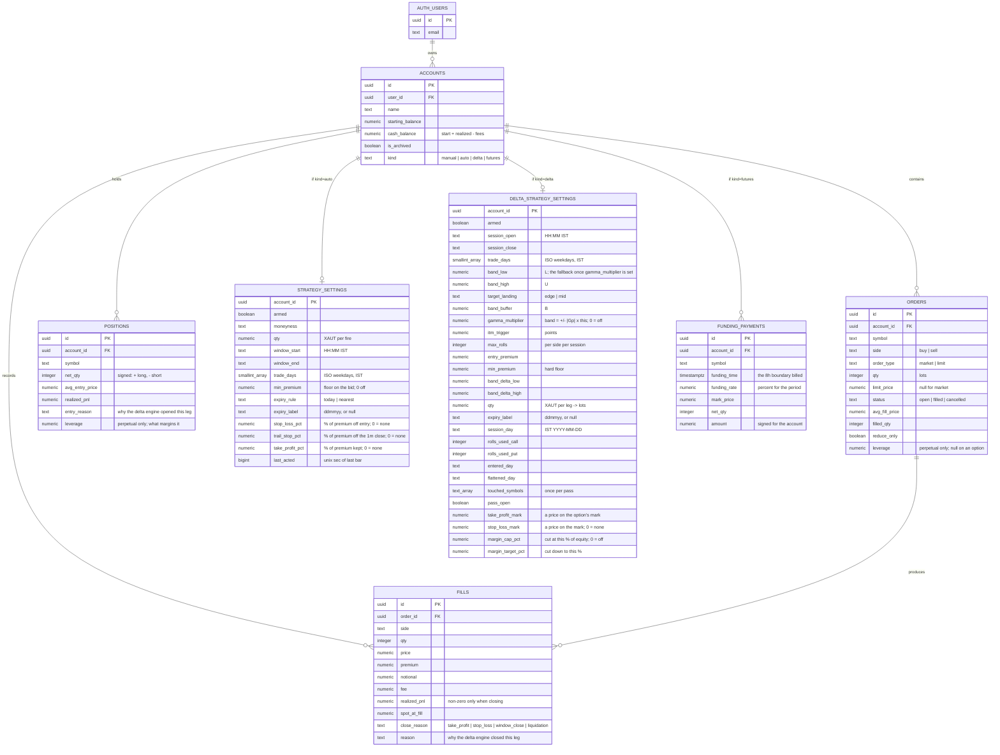
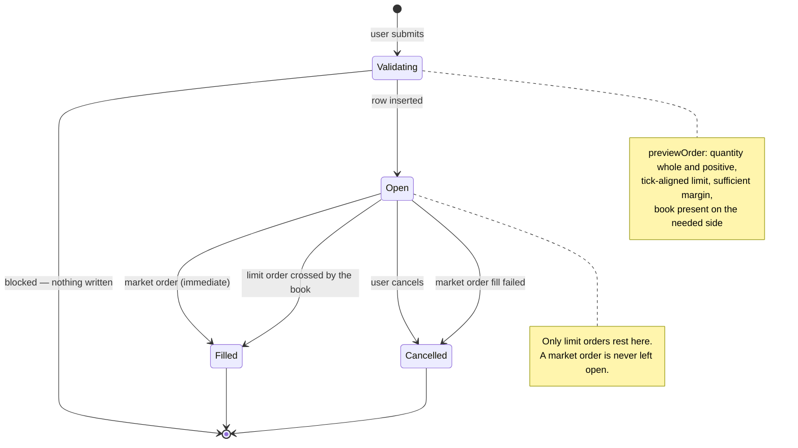
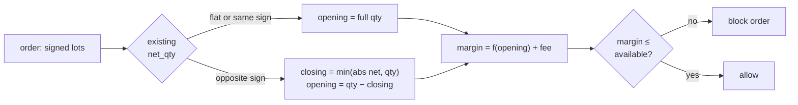
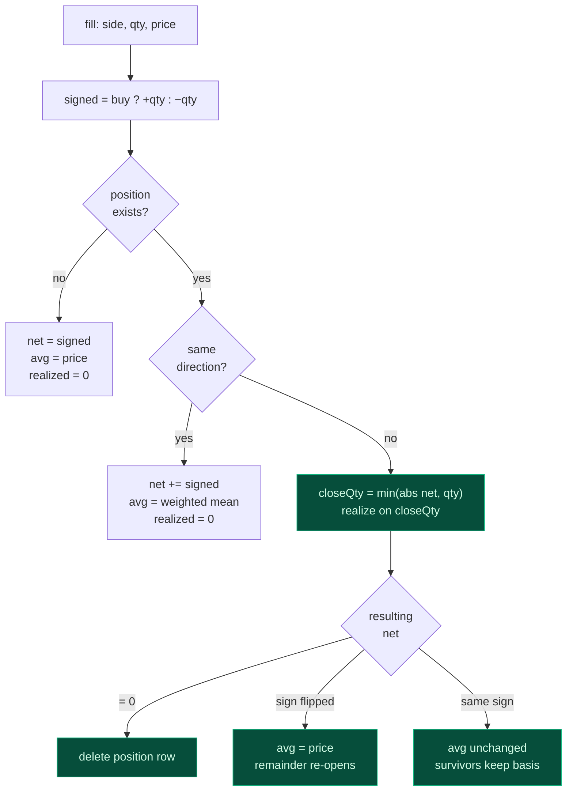
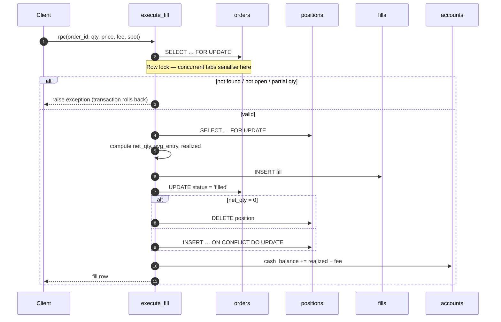
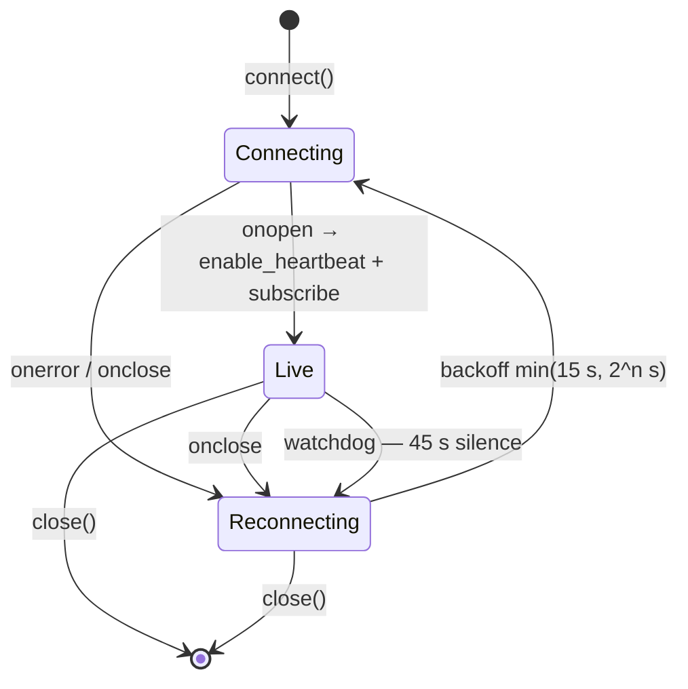

# Low-Level Design

**XAUT Options — Paper Trading Terminal**

Implementation-level reference: schema, algorithms, module contracts and formulas.
For rationale and system context see [HLD.md](HLD.md).

---

## 1. Contract mechanics

Everything downstream depends on getting these units right.

| Quantity | Formula | Example (4040 call @ 24.90, spot 4038.77) |
| --- | --- | --- |
| Contract value | Product field | `0.001` XAUT per lot |
| Premium (USD) | `price × contract_value × lots` | `24.90 × 0.001 × 1000 = $24.90` |
| Notional (USD) | `spot × contract_value × lots` | `4038.77 × 0.001 × 1000 = $4,038.77` |
| Quote unit | USD per XAUT | `24.90` |
| Tick size | Product field | `0.01` |

One lot is worth about 2.5 cents of premium and carries $4 of underlying
exposure. This is genuinely how Delta sizes XAUT options — it is why quoted book
sizes run to five figures, and why the UI shows four decimal places on premium
and fee columns.

### Symbol grammar

```
C-XAUT-4040-300726
│ │    │    └── expiry, ddmmyy (30 Jul 2026, settles 16:00 UTC)
│ │    └─────── strike price
│ └──────────── underlying
└────────────── C = call, P = put
```

`parseSymbol` returns `null` on anything that does not match, and callers treat
`null` as "not our instrument" rather than throwing.

### The perpetual

`XAUTUSD` is the venue's only non-option XAUT contract and is deliberately *not*
in the grammar above: it has no strike, no expiry and four characters where the
options have four hyphen-separated fields, so `parseSymbol` returns `null` for it
and every option-shaped filter excludes it for free.

| Quantity | Formula | Example (mark 4380.82) |
| --- | --- | --- |
| Contract value | Product field | `0.001` XAUT per lot |
| Notional (USD) | `mark × contract_value × lots` | `4380.82 × 0.001 × 1000 = $4,380.82` |
| Margin | `notional / leverage`, floor `im% × notional` | at 10x: `$438.08` |
| Funding | `mark × cv × lots × rate / 100`, every `expiry_interval` | at `+0.0050%`: `$0.22` per 8h |
| Maintenance | `mm% × mark × cv × lots` | `0.5% → $21.90` |

The notional is priced off the contract's *own* mark rather than off the spot
index, unlike an option: on a linear contract the two differ only by the basis,
and it is the mark the venue margins and liquidates against.

`isPerp(contract_type)` is the single test the rest of the codebase branches on.

---

## 2. Data model



### Invariants

| # | Invariant | Enforced by |
| --- | --- | --- |
| 1 | One netted position per `(account_id, symbol)` | `unique (account_id, symbol)` |
| 2 | A `positions` row always means live exposure | Row deleted when `net_qty` reaches 0 |
| 3 | A limit order has a price; a market order does not | `orders_limit_price_required` check |
| 4 | `qty > 0` on orders and fills | Column checks |
| 5 | `fills` are immutable | Never updated or deleted outside `reset_account` |
| 6 | Every row belongs to `auth.uid()` | RLS `USING` + `WITH CHECK` |
| 7 | Only an `open` order can fill | `execute_fill` status guard |
| 8 | A funding boundary is billed at most once per position | `unique (account_id, symbol, funding_time)` |

> **Invariant 2 has a consequence:** closing a position deletes the row and with it
> its `realized_pnl` counter. That is intentional — realized P&L lives durably on
> `fills` and in `cash_balance`; the column is a convenience for open positions only.

### Indexes

| Index | Columns | Serves |
| --- | --- | --- |
| `accounts_user_idx` | `(user_id, created_at)` | Account switcher listing |
| `orders_account_status_idx` | `(account_id, status, created_at desc)` | Order history |
| `orders_open_idx` | `(account_id) where status = 'open'` | Partial — the fill engine only scans open orders |
| `fills_account_idx` | `(account_id, created_at desc)` | Trade history |
| `positions_account_idx` | `(account_id)` | Positions table and P&L totals |
| `funding_account_idx` | `(account_id, funding_time desc)` | The perpetual's funding ledger |
| `trail_candle_requests_created_idx` | `(created_at)` | Trimming the pg_net request-id → symbol map the trailing stop matches its candle replies by |

---

## 3. Order lifecycle



| Transition | Trigger | Writes |
| --- | --- | --- |
| → `open` | Insert succeeds | `orders` |
| `open` → `filled` (market) | Immediately after insert | `fills`, `positions`, `accounts` |
| `open` → `filled` (limit) | Book crosses the limit | same |
| `open` → `cancelled` | User action | `orders.status`, `cancel_reason` |
| `open` → `cancelled` | Market fill failed | `orders.status = 'Fill failed'` |

---

## 4. Pricing rules

### Which price applies

| Context | Long / buy | Short / sell | Empty side |
| --- | --- | --- | --- |
| Market order fill | `best_ask` | `best_bid` | Order blocked |
| Position mark | `best_bid` | `best_ask` | P&L renders `—` |
| Limit crossing test | `best_ask ≤ limit` | `best_bid ≥ limit` | Rests |
| Limit fill price | `best_ask` (the touch) | `best_bid` (the touch) | — |

Two consequences follow, both intended:

- **Crossing the spread shows up immediately.** Buy at the ask, mark at the bid, and
  the position opens down the full spread — exactly as on a real book.
- **A limit order fills at the touch, not at its limit.** A buy limit at 30 against a
  24.90 offer fills at **24.90**, the better price, as a real book would give you.

### Fees

```
fee = min( taker_rate × spot × cv × lots ,   ← 0.01% of notional
           premium_cap × price × cv × lots )  ← 3.5% of premium
```

Both rates come from the product payload rather than constants, so the app tracks
venue changes. The notional leg binds at normal premiums; the premium cap binds on
cheap far-out strikes.

| Case | Price | Notional leg | Premium cap | Charged |
| --- | --- | --- | --- | --- |
| Near the money | 24.90 | $0.4039 | $0.8715 | **$0.4039** |
| Deep out of the money | 0.05 | $0.4039 | $0.00175 | **$0.00175** |

### Margin

| Position | Margin blocked | Exact? |
| --- | --- | --- |
| Long option | `avg_entry × cv × lots` — the premium paid | Yes; loss is capped at premium |
| Short option | `(im% × spot + mark) × cv × lots` | Rate is the venue's; scaling is not |
| Perpetual, either side | `mark × cv × lots / leverage`, floored at `im% × notional` | Rate is the venue's; scaling is not |

Direction does not enter into the perpetual row, and that is the whole difference
from the option rows above it: a long option has already paid its maximum loss in
premium and the venue asks for nothing more, whereas a long future can lose
without limit exactly as a short one can. `perpMargin` is where that lives.

`im%` is the contract's own `initial_margin`, read off the product by
`shortImRate` in [`src/engine/paper.ts`](../src/engine/paper.ts) — 1% for an XAUT
option. The field is a percentage, which `BTCUSD` settles: it publishes `0.5`
against a default leverage of 200, and 200x is 0.5% margin.

This used to be a hardcoded 10%, on the stated grounds that Delta did not publish
the number. They do. Two things are still approximate: Delta raises the rate with
order size via `initial_margin_scaling_factor`, which is not modelled, so a large
short margins slightly cheaper here; and accounts on portfolio margin instead of
isolated margin are floored at `max(5% × premium, OM% × notional)`, which for a
naked short can bind well above this figure.

`FALLBACK_SHORT_IM_RATE` applies only where the product is not loaded at all, as
with a contract that has already expired.

Only the portion of an order that *increases* exposure requires new margin:



### Account arithmetic

| Line | Formula |
| --- | --- |
| Balance | `starting_balance + Σ realized − Σ fees` |
| Unrealized | `Σ` over positions of exit-marked P&L |
| Equity | `Balance + Unrealized` |
| Margin blocked | `Σ` per-position margin |
| Available | `Equity − Margin blocked` |

Open positions are deliberately excluded from Balance — premium is not debited on
entry. This keeps realized and unrealized strictly separable and matches Delta's
own presentation.

**Worked example** — buy 1000 lots of the 4040 call at ask 28.50, bid 27.30, from $10,000:

| Line | Value | Derivation |
| --- | --- | --- |
| Premium | $28.50 | `28.50 × 0.001 × 1000` |
| Fee | $0.4039 | notional leg binds |
| Balance | $9,999.60 | `10000 − 0.4039` |
| Mark | 27.30 | best bid — the exit price |
| Unrealized | −$1.20 | `(27.30 − 28.50) × 1000 × 0.001` |
| Equity | $9,998.40 | `9999.60 − 1.20` |
| Margin | $28.50 | premium paid |
| Available | $9,969.90 | `9998.40 − 28.50` |

The −$1.20 is precisely the 1.20 spread. Values above were confirmed in the running app.

---

## 5. Position netting

Implemented in `execute_fill`; mirrored in JS in the test suite so the rules are
verifiable without a database.



### Rules

| Case | `net_qty` | `avg_entry_price` | Realized |
| --- | --- | --- | --- |
| Open new | `signed` | `price` | 0 |
| Add same direction | `net + signed` | `(abs(net)·avg + qty·price) / (abs(net) + qty)` | 0 |
| Partial reduce | `net + signed` | **unchanged** | on `closeQty` |
| Full close | 0 → row deleted | — | on all lots |
| Flip through zero | `net + signed` | `price` | on `closeQty` only |

Realized P&L on the closed lots:

```
long  closed by selling:  (price − avg_entry) × closeQty × cv
short closed by buying:   (avg_entry − price) × closeQty × cv
```

### Worked cases

| Sequence | Result | Realized |
| --- | --- | --- |
| Buy 1000 @ 20, buy 1000 @ 30 | `+2000 @ 25` | 0 |
| Buy 1000 @ 20, sell 400 @ 30 | `+600 @ 20` | `+$4.00` |
| Buy 1000 @ 20, sell 1000 @ 25 | flat | `+$5.00` |
| Sell 1000 @ 30, buy 1000 @ 22 | flat | `+$8.00` |
| Buy 1000 @ 20, **sell 1500 @ 26** | `−500 @ 26` | `+$6.00` (1000 lots only) |
| Buy 250 each @ 10/20/30/40, sell 1000 @ 35 | flat | `+$10.00` |

The flip case is the one worth internalising: only the 1000 closed lots realize;
the 500-lot short opens fresh at 26.

---

## 6. Transactional fill



Guards, in order:

| Check | Failure |
| --- | --- |
| Order exists | `order % not found` |
| Status is `open` | `order % is %, not open` |
| `qty = qty − filled_qty` | `partial fills are not supported` |

All four writes plus the balance update occur in one transaction. Any raise rolls
back everything, so a fill without a position — or a balance moved without a
fill — cannot occur.

> **Implementation notes.** The existing row in `ON CONFLICT DO UPDATE` is referenced
> as `positions.realized_pnl`, unqualified by schema — `public.positions.…` is not
> valid there. Direction is compared with explicit boolean tests rather than
> `sign()`, since `sign()` on an integer relies on overload resolution not worth
> depending on. Both functions are `SECURITY INVOKER`, so RLS still scopes every
> row they touch.

---

## 7. Market data layer

### Ticker cache

`marketStore` decouples tick arrival from rendering.

| Aspect | Implementation | Reason |
| --- | --- | --- |
| Storage | `Map<symbol, Ticker>` | O(1) lookup per row |
| Writes | Synchronous, set a dirty flag | Never drop a tick |
| Notification | `setInterval` 250 ms, only if dirty | Cap repaints at 4/sec |
| React binding | `useSyncExternalStore` over a version counter | Stable snapshot; no per-tick allocation |
| Merge | `{ ...prev, ...next }` | WS payloads may omit fields |
| Timer lifecycle | Started on first subscriber, cleared on last | No idle timer |

Components subscribe with `useMarketTick()` for invalidation, then read
`market.get(symbol)` during render. Unconventional, but it means a tick allocates
nothing and re-renders only subscribers.

### WebSocket lifecycle



| Concern | Handling |
| --- | --- |
| Dead-but-open socket | Heartbeat enabled; 45 s of silence forces a close |
| Reconnect storms | Exponential backoff, capped at 15 s, reset on success |
| Expiry switch | Diff old/new symbol sets; unsubscribe removed, subscribe added |
| Off-screen positions | Held and resting symbols pinned into the subscription |
| Stale socket callbacks | Handlers check `this.ws === ws` before acting |

Subscribed set = visible expiry ∪ held symbols ∪ resting-order symbols. Roughly 40
symbols instead of 150, without breaking P&L on other expiries.

---

## 8. Module contracts

### `engine/paper.ts` — pure, no I/O

| Function | Signature | Notes |
| --- | --- | --- |
| `marketFillPrice` | `(ticker, side) → number \| null` | `null` = that side is empty |
| `exitPrice` | `(ticker, netQty) → number \| null` | Bid for longs, ask for shorts |
| `computeFee` | `(product, price, qty, spot) → number` | Rates from the product |
| `valuePosition` | `(pos, ticker, spot) → PositionValue` | Mark, value, unrealized, margin |
| `summarizeAccount` | `(cash, positions, tickerFor, spot) → AccountSummary` | Balance/equity/available |
| `previewOrder` | `(intent, ticker, spot, existing, available) → OrderPreview` | `error` blocks; `warning` informs |
| `crossesNow` | `(side, limitPrice, ticker) → number \| null` | Fill price at the touch, or `null` |
| `perpMargin` | `(price, cv, lots, imRate, leverage) → number` | Notional over leverage, floored at the rate |
| `maintenanceRate` | `(product) → number` | `maintenance_margin` as a fraction |
| `maxLeverage` | `(product) → number` | The lesser of the published figure and `1 / imRate` |
| `liquidationPrice` | `(netQty, avgEntry, cv, cash, mmRate) → number \| null` | `null` where no mark can liquidate |
| `fundingPayment` | `(mark, cv, netQty, ratePct) → number` | Signed for the account; negative is paid away |

`null` consistently means "unknown", never zero. This is what makes an empty book
render `—` rather than a plausible-looking wrong number.

### `hooks/useTrading.ts`

| Export | Purpose |
| --- | --- |
| `positions`, `openOrders`, `fills` | Current account state |
| `placeOrder` | Validate → insert → fill if crossing → refetch |
| `cancelOrder` | Guarded by `.eq('status','open')` |
| `closePosition` | Opposing market order, `reduce_only` |
| `registerProducts` | Supplies product metadata to the fill engine |
| `reload` | Refetch all three tables |

Concurrency guard: an `inFlight` ref of order ids stops a tick burst from
double-submitting. The DB row lock and status check are the real defence.

### `lib/deltaStrategy.ts` — pure, no I/O

The delta strategy's rules, with no React and no fetching, so the band maths can
be reasoned about on its own. The browser uses it for the readout; the executing
copy is PL/pgSQL in
[`0012`](../supabase/migrations/0012_delta_strategy_engine.sql).

| Function | Signature | Notes |
| --- | --- | --- |
| `sessionPhase` | `(now, cfg) → { phase, day, tradingDay }` | `before \| open \| closed`, IST; handles a window that wraps midnight, and reports a day outside `tradeDays` as closed |
| `bookDeltas` | `(positions, tickerFor, spot) → { legs, missing }` | `missing` legs are reported, never guessed at; a leg needs both delta and gamma to count |
| `portfolioDelta` | `(legs) → number` | `Σ(signed lots × option delta)` |
| `portfolioGamma` | `(legs) → number` | `Σ(signed lots × option gamma)`; negative on a short book |
| `effectiveBand` | `(cfg, gp) → Band` | `±\|Γp\| × gammaMultiplier`, or the typed pair when off or underivable |
| `bandBreach` | `(dp, band) → 'low' \| 'high' \| null` | Reads the band in force, not the config |
| `landingTarget` | `(cfg, band, breach) → number` | Edge drawn back by `B`, or the midpoint |
| `itmQueue` | `(legs, cfg) → LegDelta[]` | Shorts at or beyond the trigger, most-ITM first |
| `rollQty` | `(target, dp, dItm, dRepl) → number` | §5.2, rounded down |
| `bandQty` | `(target, dp, dSelected) → number` | §5.4, rounded down |
| `pickByPremium` | `(expiry, kind, cfg, tickerFor, beyond?) → StrikePick \| null` | `beyond` is what makes a roll a roll |
| `pickByDelta` | `(expiry, kind, cfg, tickerFor) → StrikePick \| null` | Inside `band_correction_delta` |
| `planCycle` | `(CycleInput) → CyclePlan` | One next action, plus the reason either way |

**Units.** Δp is in *contract-deltas* — no `contract_value` factor. That is the
unit the specification's worked example is written in (2 contracts across a 0.25
delta gap moves Δp by 0.5), and `[L, U]` is calibrated to the same one. Reading
it as XAUT-denominated delta would put every band figure out by 1000×.

**The band.** `[L, U]` is only the band when `gammaMultiplier` is zero. Above
zero the band is `±|Γp| × gammaMultiplier`, recomputed each cycle, and `L`/`U`
become the fallback for the two cases a derived band cannot cover — a flat book
and a book whose gamma has rounded away, both of which would give a width of zero
that every non-zero Δp breaches.

Γp is scaled by `contract_value` before the multiplier is applied, because the
multiplier is set against a band figure and the two have to be in one unit. The
magnitude is taken: this strategy only sells, so Γp is negative, and a signed
band would come out with `low` above `high`.

`Band.pending` separates *Γp is not in yet* from *there is no Γp*. Both hand back
the typed pair, but only the second is a settled answer; the first is a band about
to be replaced the moment the greeks land, and `planCycle` sets it because it is
the only thing that knows whether legs are held whose greeks are outstanding. The
readout prints an em dash rather than a fallback while it is set. Nothing acts in
that window — Δp is null for the same reason, and every branch that reads the band
is behind a non-null Δp.

Everything downstream reads the `Band`, not the config — the breach test, the
landing target, and the margin cut's side preference. The SQL side derives it
once per account per pass in
[`0039`](../supabase/migrations/0039_delta_gamma_band.sql) via `delta_band`,
which is the same rule as `effectiveBand` and has to be kept in step with it by
hand, like every other rule here.

> Which is why `qty` ([`0021`](../supabase/migrations/0021_qty_and_take_profit.sql))
> is the one setting that cannot be changed in isolation. It sizes the entry in
> XAUT the way the auto strategy does — `lots = round(qty / contract_value)`, and it
> is the spec's `N` in XAUT rather than lots, `pairs` having been folded into it by
> [`0024`](../supabase/migrations/0024_drop_pairs_and_fix_reentry.sql). Δp counts
> lots, so lots scale Δp one-for-one. At 1 XAUT a leg is
> 1000 lots and a 0.30-delta option contributes 300, which breaches the default
> `[-1, 1]` from the first fill and never recovers. The sizing formulas are
> scale-free and will compute correct contract counts either way; the *band* is
> what has to be rescaled with the size. It defaults to exactly one lot, so an
> existing account is untouched until the number moves.

**Rounding.** Both sizing formulas floor with a `1e-9` tolerance. A plain floor
gets the specification's own example wrong: the deltas are two-decimal
quantities, but `0.55 − 0.30` is `0.2500000000000001` in binary, so `0.5 ÷ that`
is `1.9999999999999996` and floors to 1 where the document says 2.

**Sides.** Δp below the band means a book too short-call heavy, so exiting an ITM
*call* lifts it and selling a fresh *put* does the same — which is why the roll
side and the sell side are always opposites.

**Brackets.** `delta_sell` arms `take_profit = take_profit_mark` with
`tpsl_trigger = 'mark'` and no stop, on any short the fill leaves open. The level
is an absolute mark price rather than a multiple of the premium sold, so adding to
a short leaves it where it is; it is only armed when `avg_entry_price` is above
it, since a take-profit at or above a short's entry would fire on the fill that
opened it. `apply_tpsl_triggers` sets `v_up := v_long` when the reference is the
mark, so a short's take-profit fires on `v_ref <= take_profit` — the mark
*falling* is the short's gain. Reading the level off the account's own settings
rather than taking it as a parameter is what keeps the signature stable for
`apply_delta_strategy` and `delta_sell_entry`.

**The auto strategy's window is both ends of the day.** `apply_strategy` sells
only inside it; `apply_auto_exit` closes every open leg on an armed auto account
once outside it, at the exit side of the book, booking `close_reason =
'window_close'`
([`0015`](../supabase/migrations/0015_auto_strategy_exit.sql)). Both read the same
`in_ist_window(start, end, at)` — a second inlined copy of that arithmetic could
drift and leave a minute that both enters and flattens. The window is inclusive
of `window_end`, so the flatten begins the minute after it; the `00:00–23:59`
default has no outside and never fires. Exits route through
`close_position_triggered` rather than a market order, so the ledger labels them
and no order row is invented for a close the engine forced. A leg that cannot be
priced from the last 90s of replies is left open and retried, never closed at a
guess.

**Days.** `trade_days` on both settings tables holds ISO weekdays — Monday 1 to
Sunday 7, `extract(isodow)`'s numbering, so the column, the SQL and the client
count alike ([`0016`](../supabase/migrations/0016_strategy_trade_days.sql)). The
day tested is the one the **session opened on**, never the current date: for the
auto strategy that is `in_ist_window`'s `wday`, non-null exactly when the clock is
inside the window and equal to its open date; for the delta strategy it is
`delta_session`'s `sday`, which already keys the counters. So unselecting Saturday
still lets a Friday 22:00 session run to its close on Saturday morning.

A day left out is *out of session*, not merely "no entries" — `delta_session`
returns `closed` and `in_ist_window` returns false, which routes an off-day into
each engine's existing flatten. Neither can be left holding a book through a day
it does not trade. An empty array is a valid off state and reads as "never". Both
`in_ist_window` and `delta_session` were dropped and recreated rather than
overloaded: two candidates that each default their tail would make the old
two-argument call ambiguous.

**The auto strategy's premium floor vetoes, the delta strategy's narrows.**
`strategy_settings.min_premium` skips a bar whose resolved strike is bid under it
([`0017`](../supabase/migrations/0017_auto_strategy_min_premium.sql)) rather than
looking for a strike that clears it — `moneyness` is the strategy's one rule about
*what* to sell, and a search would override it and could walk the position deep
into the money on a thin day. `delta_strategy_settings.min_premium` reads the same
(Section 6: nothing is sold below the floor), but it is already picking a strike
by premium, so there the floor narrows a search rather than blocking one. A
skipped bar consumes `last_acted`, like every other skip path: the poll only
fetches in the first minutes of an hour, so the bar cannot be retried, and leaving
it unconsumed would re-log the same decision every minute for the rest of it.

**An expiry chosen by date does not roll.** `expiry_label` on both settings tables
holds a `ddmmyy` picked from the live chain
([`0023`](../supabase/migrations/0023_explicit_expiry.sql)), and each engine honours
it only while that expiry is still listed and unsettled. When it is not, the auto
strategy skips the bar and the delta strategy stands down — neither falls through
to another contract, because silently trading an expiry nobody selected is the
fault `0018` was written to remove and an explicit choice deserves the same
guarantee. Null falls back to the rule, which is what a fresh account uses.

One ordering detail in `apply_delta_strategy`: the session-close flatten sits
*before* the expiry lookup, so a stale expiry can never strand an open book. The
flatten reads positions, not settings.

**Nearest-unsettled is not the same as today.** `apply_strategy` sold the nearest
expiry still to settle, which diverges from the same-day contract two ways: XAUT
lists no contract for every calendar day (Mon 10 / Tue 11 / Fri 14 Aug leaves
Wednesday and Thursday with none), and the same-day one settles at 16:00 UTC =
21:30 IST. `expiry_rule = 'today'` — the default from
[`0018`](../supabase/migrations/0018_auto_strategy_expiry_rule.sql) — takes only
the contract whose label is the current IST date *and* is still unsettled, and
skips the bar otherwise rather than falling through.

It reads the **current** IST date, not the window's open day. A wrapped window
(22:00–06:00) belongs to its open day for the days filter, but that day's expiry
settled at 21:30 IST, before the tail even begins — so the overnight tail can only
ever trade the new day's contract.

The expiry now varies per account, so the strike ranking that `_k` used to hold in
a temp table built once before the account loop is a ranked subquery over `_chain`
instead. Deliberately not a temp table created inside the loop: that is the
plpgsql plan-caching trap [`0012`](../supabase/migrations/0012_delta_strategy_engine.sql)
called out when it chose an unlogged `delta_chain` over a temp one.

### Validation matrix

| Condition | Result | Message |
| --- | --- | --- |
| Fractional or non-positive qty | Blocked | whole number of lots |
| Market order, empty side | Blocked | market order cannot fill |
| Limit with no price | Blocked | enter a limit price |
| Off-tick limit price | Blocked | multiple of *tick* |
| Margin > available | Blocked | insufficient margin |
| Limit away from market | Allowed | will rest until it crosses |
| Spread > 10% on a market order | Allowed | wide spread — you are crossing it |

---

## 9. Degradation

| Input | Behaviour | Never |
| --- | --- | --- |
| Missing exit-side quote | Mark and P&L render `—` | Report `0` P&L |
| Both sides empty | Row shows `—`; orders blocked | Fabricate a mid |
| Contract absent from chain | Close button disabled with a tooltip | Silently fail |
| Illiquid strike, absurd bid | Marked honestly at that bid | Substitute mark price |
| `null` mark in totals | Contributes 0 to the sum, row shows `—` | Poison the total with `NaN` |

The illiquid case is worth calling out: a deep-ITM put quoted with a lowball bid
and no ask will show a large unrealized loss. That is the honest consequence of
exit-price marking, not a defect — but it surprises people.

---

## 10. Verification

| Area | Method | Result |
| --- | --- | --- |
| Fees, margin, P&L, validation, crossing, netting | 30 assertions against a real ticker payload | Pass |
| Delta REST + WS contracts | Live calls to `api.india.delta.exchange` | Confirmed |
| Chain rendering, greeks, ATM anchor | Browser, live data | Confirmed |
| Order ticket maths | Browser — premium, notional, fee, margin | Matches derivations above |
| Position marking | Browser — long marked at bid, −$1.20 = spread | Confirmed |
| Schema deployment | Table probe + RLS write probe | Tables present; anon write → `42501` |
| `execute_fill` compiles | RPC reached the internal `raise` | Confirmed |
| `lib/deltaStrategy.ts` | 65 assertions — §5.2 worked example end to end, band and landing rules, corrective sides, ITM queue, the session clock across zones | Pass, on synthetic fixtures |
| Tickers payload shape | Live call — `greeks.delta`, `quotes`, `spot_price`, `contract_value` on all 113 XAUT symbols; **no `settlement_time`** | Confirmed |
| Delta strategy daily entry | Armed live — built the 113-row snapshot and sold its symmetric pair | Confirmed |

### Outstanding

**The write path inside `execute_fill`** — `INSERT INTO fills` and the positions
upsert — has not executed. Postgres plans statements inside a PL/pgSQL function on
first execution, so deployment success does not prove those two statements. The
first real trade validates them; if the schema misbehaves, that is where to look.

**The delta strategy past its daily entry.** The roll, exit-only and
band-correction branches of `apply_delta_strategy` have never run against a live
book — with `N = 1` the book cannot breach a ±1 band, so nothing has reached
them. They are exactly the branches that place and unwind size. Treat the first
live breach as the real test, and raise `N` deliberately rather than discovering
it in a moving market.

**Two implementations of one rule set.** `lib/deltaStrategy.ts` and
[`0012`](../supabase/migrations/0012_delta_strategy_engine.sql) encode the same
specification in TypeScript and PL/pgSQL. Only the first is covered by
assertions, and nothing checks that they agree — a divergence would surface as
the readout predicting one thing and the engine doing another.

> A second instance, found the day a teammate toggled a weekday off and on again:
> the flatten stamped `flattened_day` but left `entered_day` set, so the reopened
> session read "already entered today" and sat flat for the rest of the day
> reporting Δp = 0 — indistinguishable from a balanced book. Fixed in
> [`0024`](../supabase/migrations/0024_drop_pairs_and_fix_reentry.sql): the flatten
> clears `entered_day` and the entry clears `flattened_day`, because clearing only
> the first would leave the close-flatten stamped and carry a position overnight.
> The two flags have to move in step.

> This is not hypothetical. The S4 entry diverged for seven migrations:
> `planCycle` left the day unstamped when no strike cleared the floor, so it
> retried; the engine stamped `entered_day` whether or not `delta_sell_entry` had
> sold anything, so one thin quote at the open cost the whole session, silently.
> Fixed in [`0019`](../supabase/migrations/0019_delta_entry_all_or_nothing.sql),
> which also made the pair all-or-nothing — symmetry was checked when picking the
> strikes but the two sells were independent, so a thrown fill on the second leg
> left a naked directional short that fault one then held all day. Both legs now
> sit inside one block whose implicit savepoint unwinds the first if the second
> does not fill, so a retry starts from flat having paid no spread.

**`0008` is a standing lesson in silent failure.** It read `settlement_time` from
`/v2/tickers`, which has never carried that field; the comparison against `now()`
was `NULL`, the expiry lookup matched nothing, and it returned `0` one line
before it would have traded — every minute, indefinitely, while `pg_cron`
recorded success. `last_acted` never leaving `NULL` was the only external symptom.
Fixed in [`0011`](../supabase/migrations/0011_strategy_expiry_fix.sql), which
also added a `raise log` to every early return.

---

## 11. Deferred work

| Item | Rationale for deferral | Sketch |
| --- | --- | --- |
| Expiry settlement | Largest gap to the real venue | On expiry, read settlement price, realize intrinsic, close position |
| Server-side limit fills | Avoids standing infrastructure | Edge Function on `pg_cron` polling REST and calling `execute_fill` |
| Size-aware fills | Touch-price fills adequate at current sizes | Walk the book against `bid_size`/`ask_size`; support partial fills |
| Maker/taker distinction | Both rates identical for XAUT today | Branch on resting vs crossing at fill time |
| Realtime sync | Refetch adequate for single-tab use | Supabase Realtime on the four tables |
| Stop-loss / take-profit | Not requested | Trigger orders evaluated in the same tick loop |
| One delta implementation | SQL was the shortest path to a tab-free engine | A worker importing `lib/deltaStrategy.ts`, so the tested code is the code that trades |
| Fees on strategy fills | Both engines pass `0` to `execute_fill` | Call `computeFee`'s SQL equivalent at fill time |
| Sub-minute delta cycles | `pg_cron`'s floor is one minute | A worker holding the feed, rather than refetching the chain each tick |

Note that size-aware fills would require relaxing the `partial fills are not
supported` guard in `execute_fill` and tracking `filled_qty` across multiple
executions — the column already exists for this.
